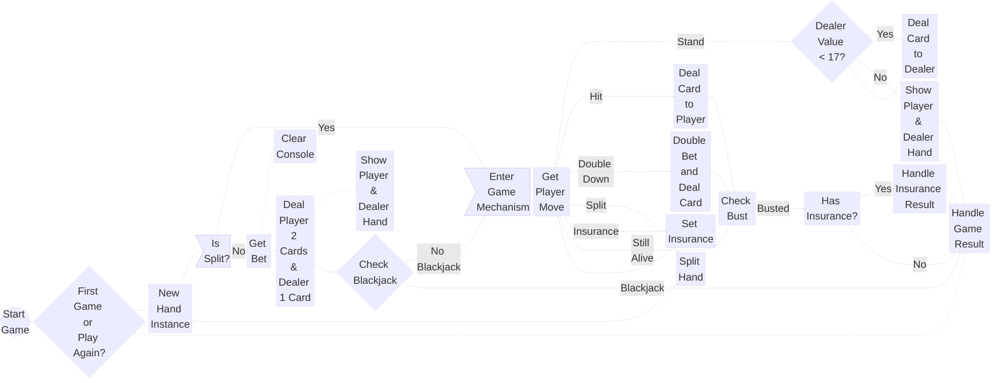

```mermaid
%%{init: {'themeVariables': { 'fontSize': '150px' }}}%%
flowchart LR
    SG((Start Game)) --> FGPA{First Game or Play Again?}
    --> NH[New Hand Instance] --> IS>Is Split?]
    --Yes--> EGM
    IS -->|No| GB[Get Bet] -.-> CC[Clear Console]
    GB --> DC[Deal Player 2 Cards & Dealer 1 Card]
    DC -.-> SH[Show Player & Dealer Hand]
    DC --> CB{Check Blackjack}
    
    CB --->|No Blackjack| EGM>Enter Game Mechanism]
    CB --Blackjack--> HGR[Handle Game Result] -.-> FGPA

    EGM --> GPM[Get Player Move] 
    GPM -->|Stand| DV17{Dealer Value < 17?}
    GPM -->|Hit| N[Deal Card to Player]--> CBU
    GPM --->|Double Down| O[Double Bet and Deal Card]--> CBU
    GPM --->|Split| P[Split Hand] --> NH
    GPM --->|Insurance| Q[Set Insurance] --> GPM

    DV17 --Yes--> DCD[Deal Card to Dealer] --> DV17
    DV17 -->|No| SHD[Show Player & Dealer Hand] --> HGR

    CBU[Check Bust] --Busted--> HI[Has Insurance?]
     --Yes--> HIR[Handle Insurance Result] --> HGR

    CBU --Still Alive--> GPM
    HI -->|No| HGR
```